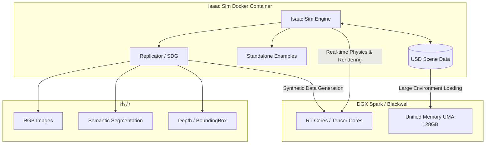

仮想空間の物理が、Blackwellの力で現実を超える。

---

## エグゼクティブサマリー

| 項目 | 結果 |
|------|------|
| **検証機** | DGX Spark（Blackwell GB10） |
| **Isaac Sim** | 5.1.0（Docker） |
| **物理シミュレーション** | 正常動作 |
| **合成データ生成** | 成功（20フレーム/3視点） |
| **制限** | aarch64ではライブストリーミング非対応 |

---

## 1. なぜロボット学習に「DGX Spark」なのか？

ロボットシミュレーション、特に大規模並列学習では、以下の3点がボトルネックになります。

| ボトルネック | 課題 | DGX Sparkの解決策 |
|-------------|------|------------------|
| 物理演算の並列性 | 数千台のロボットを同時にシミュレートする計算力 | Blackwell世代のTensorコア |
| メモリ帯域 | 複雑なシーン（USDファイル）と大量のエージェントデータの処理 | 128GB UMA（ユニファイドメモリ） |
| フォトリアルな描写 | 学習精度を高めるための高精度レイトレーシング | 第3世代RTコア |

---

## 2. 検証環境

| 項目 | 値 |
|------|-----|
| GPU | NVIDIA GB10（Blackwell / Tegra） |
| Driver | 580.95.05 |
| CUDA | 13.0 |
| メモリ | 128GB UMA（統合メモリ）、約92GB利用可能 |
| OS | Ubuntu 24.04.2 LTS（Linux 6.14.0-1015-nvidia） |
| アーキテクチャ | aarch64（ARM64） |
| Docker | 28.x |
| Isaac Sim | 5.1.0 |

---

## 3. システム構成図



---

## 4. 実装ステップ

### Step 1: 環境確認

Isaac Simは最新のドライバと高度なGPU機能を要求します。

```bash
# ホスト側でGPU確認
nvidia-smi
```

確認結果:
```
+-----------------------------------------------------------------------------------------+
| NVIDIA-SMI 580.95.05              Driver Version: 580.95.05      CUDA Version: 13.0     |
+-----------------------------------------+------------------------+----------------------+
| GPU  Name                 Persistence-M | Bus-Id          Disp.A | Volatile Uncorr. ECC |
|   0  NVIDIA GB10                    On  |   0000000F:01:00.0  On |                  N/A |
+-----------------------------------------+------------------------+----------------------+
```

DockerからGPUにアクセスできるか確認:

```bash
docker run --rm --gpus all nvidia/cuda:12.4.1-base-ubuntu22.04 nvidia-smi
```

同様の出力が表示されればOKです。

### Step 2: NGCへのログイン

Isaac SimのイメージはNVIDIAのプライベートレジストリ（NGC）にあるため、認証が必要です。

[NGC Personal Key](https://org.ngc.nvidia.com/setup/personal-keys) を発行し（権限は `NGC Catalog` のみで十分）、以下でログイン:

```bash
docker login nvcr.io -u '$oauthtoken'
# Password: に NGC Personal Key を入力
```

`Login Succeeded` が表示されればOK。

### Step 3: Isaac Simイメージの取得

```bash
docker pull nvcr.io/nvidia/isaac-sim:5.1.0
```

イメージサイズは約15〜20GBあるため、回線速度によっては時間がかかります。

### Step 4: Docker Compose の設定

毎回長いコマンドを打たなくて済むよう、`docker-compose.yml`を作成します。

```bash
mkdir -p ~/docker/isaac-sim/cache/kit ~/docker/isaac-sim/cache/ov
cd ~/docker/isaac-sim
```

`docker-compose.yml`:

```yaml
services:
  isaac-sim:
    image: nvcr.io/nvidia/isaac-sim:5.1.0
    container_name: isaac-sim
    entrypoint: bash
    stdin_open: true    # -i に相当
    tty: true           # -t に相当
    runtime: nvidia
    network_mode: host
    environment:
      - ACCEPT_EULA=Y
      - NVIDIA_VISIBLE_DEVICES=all
    volumes:
      - ./cache/kit:/root/.cache/nvidia/atoms
      - ./cache/ov:/root/.local/share/ov/data
    deploy:
      resources:
        reservations:
          devices:
            - driver: nvidia
              count: all
              capabilities: [gpu]
```

| 設定 | 意味 |
|-----|------|
| `image` | 使用するコンテナイメージ |
| `entrypoint: bash` | 起動時にbashシェルに入る |
| `stdin_open` + `tty` | 対話的に操作可能にする |
| `runtime: nvidia` | NVIDIAランタイムを使用 |
| `network_mode: host` | ホストネットワークを共有 |
| `volumes` | キャッシュをホストに永続化（2回目以降の起動高速化） |

### Step 5: コンテナの起動

```bash
cd ~/docker/isaac-sim
docker compose run --rm isaac-sim
```

起動すると、コンテナ内のbashプロンプトに入ります:

```
isaac-sim@hostname:~$
```

### Step 6: 動作確認（物理シミュレーション）

コンテナ内でサンプルスクリプトを実行:

```bash
cd /isaac-sim && ./python.sh standalone_examples/tutorials/getting_started.py
```

初回はシェーダーコンパイル等で時間がかかります。以下のようなログが出力されれば成功:

```
Simulation App Starting
...
| GPU | Name                             | Active | GPU Memory |
| 0   | NVIDIA Tegra NVIDIA GB10         | Yes: 0 | 91927   MB |
...
Warp 1.8.2 initialized:
   CUDA Toolkit 12.8, Driver 13.0
   Devices:
     "cuda:0"   : "NVIDIA GB10" (120 GiB, sm_121, mempool enabled)
...
Simulation App Startup Complete
simulator running 0
simulator running 1
Adding Physics Properties to the Visual Cube
simulator running 2
Adding Collision Properties to the Visual Cube
Simulation App Shutting Down
```

GB10 GPUが認識され、物理シミュレーションが実行されました。

---

## 5. 合成データ生成（Synthetic Data Generation）

### なぜ合成データか？

ロボット学習では大量の教師データが必要ですが、実世界でのデータ収集はコストがかかります。Isaac Simの**Replicator**を使えば、フォトリアルな画像とアノテーション（セグメンテーション、バウンディングボックス等）を自動生成できます。

### 実行

```bash
cd /isaac-sim && ./python.sh standalone_examples/replicator/scene_based_sdg/scene_based_sdg.py --headless
```

倉庫シーンにフォークリフト、パレット、コーン、段ボールを配置し、20フレームの合成データを生成します。

### 出力の確認

```bash
ls /isaac-sim/_out_scene_based_sdg/
# TopView  PalletView  DriverView  metadata.txt
```

各視点（TopView等）に以下のデータが生成されます:

| データ | 説明 |
|-------|------|
| `rgb/` | レンダリング画像（PNG） |
| `semantic_segmentation/` | ピクセル単位のクラスラベル |
| `bounding_box_2d_tight/` | 2Dバウンディングボックス |
| `bounding_box_3d/` | 3Dバウンディングボックス |
| `distance_to_image_plane/` | 深度画像 |
| `occlusion/` | オクルージョン情報 |

### 画像の取り出し

別ターミナル（ホスト側）で実行:

```bash
# コンテナ名を確認
docker ps
# NAMES列を確認（例: isaac-sim-isaac-sim-run-xxxxx）

# 画像をコピー
docker cp <コンテナ名>:/isaac-sim/_out_scene_based_sdg ~/docker/isaac-sim/output

# 確認
ls ~/docker/isaac-sim/output/TopView/rgb/
# rgb_0000.png  rgb_0001.png  ...  rgb_0019.png
```

---

## 6. 制限事項と注意点

### ライブストリーミング非対応（aarch64）

DGX Spark（aarch64/ARM64アーキテクチャ）では、**Isaac Sim 5.1.0のライブストリーミング機能が非対応**です。

```bash
$ cat /isaac-sim/runheadless.sh
# 出力:
# if [ "$(uname -m)" = "aarch64" ]; then
#     echo 'Livestreaming is not supported on aarch64 for 5.1.0.'
```

そのため、リアルタイムでGUIを確認することはできません。代替手段として:

- **Replicatorで画像を生成**して後から確認
- **動画として書き出し**してから再生

### Isaac Labは別途インストールが必要

Isaac Sim 5.1.0には**Isaac Lab（旧Orbit）が同梱されていません**。強化学習を行う場合は、別途Isaac Labをクローンしてセットアップする必要があります。

---

## 7. 検証結果

### GPU認識とメモリ

| 項目 | 値 |
|-----|-----|
| GPU名 | NVIDIA Tegra NVIDIA GB10 |
| 利用可能メモリ | 91,927 MB（約90GB） |
| Compute Capability | sm_121 |
| CUDA Toolkit | 12.8 |
| Warp | 1.8.2 |

128GB UMAのうち約90GBがGPUから利用可能。OSやシステムが残りを使用しています。

### 合成データ生成

| 項目 | 結果 |
|-----|------|
| シーン | Simple_Warehouse（倉庫環境） |
| 生成フレーム数 | 20フレーム |
| カメラ視点 | 3視点（TopView, PalletView, DriverView） |
| 出力サイズ | 約90MB（全データ合計） |
| 解像度 | 512x512 |

### 起動時間

| フェーズ | 時間 |
|---------|------|
| Isaac Sim起動（初回） | 約15秒 |
| シミュレーション実行 | 数秒 |
| SDG（20フレーム生成） | 約2分（アセットダウンロード含む） |

---

## 8. ディレクトリ構成

```
~/docker/isaac-sim/
├── docker-compose.yml
├── cache/
│   ├── kit/          # Isaac Simのアセットキャッシュ
│   └── ov/           # Omniverseのデータキャッシュ
└── output/           # 生成した合成データ
    ├── TopView/
    │   ├── rgb/
    │   ├── semantic_segmentation/
    │   └── ...
    ├── PalletView/
    └── DriverView/
```

---

## 9. トラブルシューティング

### NGC レジストリの `Access Denied`

```bash
docker login nvcr.io -u '$oauthtoken'
```

でログインしてから再実行してください。

### GLFW initialization failed（Warning）

ヘッドレス環境では以下の警告が出ますが、**動作には影響ありません**:

```
[Warning] [carb.windowing-glfw.plugin] GLFW initialization failed.
```

### docker: command not found（コンテナ内）

コンテナ内では`docker`コマンドは使えません。別ターミナルでホスト側から実行してください。

---

## まとめ

DGX Spark（Blackwell GB10）上でIsaac Sim 5.1.0を動作させ、以下を確認しました:

| 項目 | 結果 |
|-----|------|
| GPU認識 | NVIDIA GB10、約90GB利用可能 |
| 物理シミュレーション | 正常動作 |
| 合成データ生成 | 倉庫シーンで20フレーム生成成功 |
| ライブストリーミング | aarch64では非対応（5.1.0時点） |
| Isaac Lab | 別途インストールが必要 |

Blackwellの持つ大容量UMA（128GB）により、大規模なシーンやモデルも余裕を持って扱えることが確認できました。

---

## 参考リンク

- [NVIDIA Isaac Sim Documentation](https://docs.omniverse.nvidia.com/isaacsim/latest/index.html)
- [NVIDIA NGC Catalog - Isaac Sim](https://catalog.ngc.nvidia.com/orgs/nvidia/containers/isaac-sim)
- [Isaac Sim Replicator Examples](https://docs.omniverse.nvidia.com/isaacsim/latest/replicator_tutorials/index.html)
