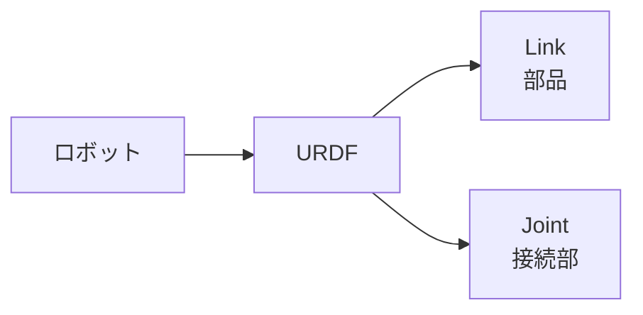
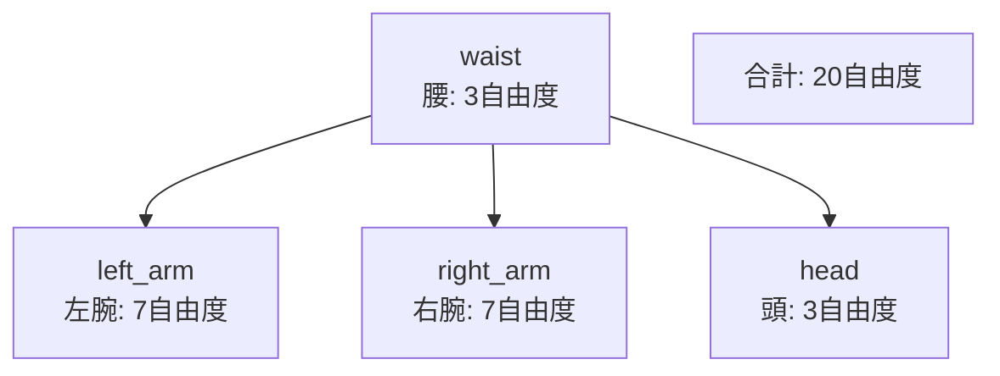

ロボット開発では、自分で設計したロボットや既存のロボットモデルをシミュレーション環境に取り込む必要があります。URDFはロボットの構造を記述する標準フォーマットで、Isaac Simはこれを直接インポートできます。

DGX Spark（Blackwell GB10）上でIsaac Sim 6.0.0にURDFファイルをインポートする手順をレポートします。

---

## エグゼクティブサマリー

| 項目 | 結果 |
|------|------|
| **URDFインポート** | 成功 |
| **物理シミュレーション** | 動作確認 |
| **GUI表示** | 正常 |
| **対応形式** | URDF → USD自動変換 |

---

## 1. 検証環境

| 項目 | 値 |
|------|-----|
| GPU | NVIDIA GB10（Blackwell） |
| メモリ | 128GB UMA |
| Isaac Sim | 6.0.0-rc.13 |
| OS | Ubuntu 24.04.3 LTS |

---

## 2. URDFとは

### Unified Robot Description Format

URDF（Unified Robot Description Format）は、ロボットの構造をXMLで記述するフォーマットです。



### 主要概念

| 用語 | 意味 | 例え |
|-----|------|------|
| **Link** | ロボットの部品 | 腕、脚、胴体 |
| **Joint** | 部品同士の接続 | 肩関節、肘関節 |
| **Visual** | 見た目の形状 | 3Dメッシュ |
| **Collision** | 衝突判定の形状 | 簡略化した形状 |
| **Inertial** | 質量・慣性 | 物理シミュレーション用 |

### URDFファイルの例

```xml
<?xml version="1.0"?>
<robot name="simple_arm">
  <!-- ベースリンク -->
  <link name="base_link">
    <visual>
      <geometry>
        <box size="0.1 0.1 0.1"/>
      </geometry>
    </visual>
  </link>

  <!-- 関節 -->
  <joint name="joint1" type="revolute">
    <parent link="base_link"/>
    <child link="link1"/>
    <axis xyz="0 0 1"/>
    <limit lower="-3.14" upper="3.14" effort="100" velocity="1"/>
  </joint>

  <!-- アームリンク -->
  <link name="link1">
    <visual>
      <geometry>
        <cylinder radius="0.05" length="0.3"/>
      </geometry>
    </visual>
  </link>
</robot>
```

---

## 3. Isaac SimでのURDFインポート

### インポートスクリプト

Isaac SimのPython APIを使ってURDFをインポートします。

```python
from isaacsim import SimulationApp

# Isaac Simを起動
# headless=Falseでウィンドウ表示、Trueで非表示
kit = SimulationApp({'renderer': 'RealTimePathTracing', 'headless': False})

import omni.kit.commands
from pxr import Gf, PhysicsSchemaTools, Sdf, UsdLux, UsdPhysics

# URDFインポート設定を作成
status, import_config = omni.kit.commands.execute('URDFCreateImportConfig')

# インポートオプション
import_config.merge_fixed_joints = False  # 固定ジョイントを統合しない
import_config.fix_base = True             # ベースを固定（浮遊しない）

# URDFファイルのパス
urdf_path = '/path/to/your/robot.urdf'

# インポート実行
status, prim_path = omni.kit.commands.execute(
    'URDFParseAndImportFile',
    urdf_path=urdf_path,
    import_config=import_config,
)
print(f'Imported: {prim_path}')

# 物理シーンの設定（重力など）
stage = omni.usd.get_context().get_stage()
scene = UsdPhysics.Scene.Define(stage, Sdf.Path('/physicsScene'))
scene.CreateGravityDirectionAttr().Set(Gf.Vec3f(0.0, 0.0, -1.0))
scene.CreateGravityMagnitudeAttr().Set(9.81)

# 地面を追加
PhysicsSchemaTools.addGroundPlane(
    stage, '/groundPlane', 'Z', 1500, Gf.Vec3f(0, 0, 0), Gf.Vec3f(0.5)
)

# ライトを追加（見やすくするため）
distantLight = UsdLux.DistantLight.Define(stage, Sdf.Path('/DistantLight'))
distantLight.CreateIntensityAttr(500)

# シミュレーション実行
omni.timeline.get_timeline_interface().play()
for i in range(500):
    kit.update()

kit.close()
```

### コードの解説

| 行 | 処理 | 説明 |
|----|------|------|
| `SimulationApp()` | Isaac Sim起動 | レンダラーやヘッドレスモードを設定 |
| `URDFCreateImportConfig` | 設定作成 | インポートオプションを準備 |
| `merge_fixed_joints` | 固定ジョイント | Trueで統合、Falseで維持 |
| `fix_base` | ベース固定 | Trueで空中に浮かない |
| `URDFParseAndImportFile` | インポート | URDFを読み込んでUSDに変換 |
| `UsdPhysics.Scene` | 物理シーン | 重力などの物理設定 |
| `addGroundPlane` | 地面追加 | ロボットが落ちないように |
| `UsdLux.DistantLight` | ライト | シーンを明るく照らす |

### インポートオプション

| オプション | デフォルト | 説明 |
|-----------|-----------|------|
| `merge_fixed_joints` | True | 固定ジョイントを親リンクに統合 |
| `fix_base` | False | ベースリンクを世界座標に固定 |
| `import_inertia_tensor` | False | 慣性テンソルをインポート |
| `default_drive_type` | Position | ジョイントの制御方式 |
| `default_drive_strength` | 1e7 | 駆動力の強さ |

---

## 4. 実行方法

### Step 1: スクリプトを保存

```bash
# エディタでスクリプトを作成
nano /tmp/urdf_import_test.py
```

上記のPythonコードを貼り付けて保存します。

### Step 2: URDFパスを確認

使用するURDFファイルのパスを確認します。

```bash
# Isaac Labに含まれるサンプルURDF
ls ~/isaac/IsaacLab/source/isaaclab/test/controllers/
```

### Step 3: 実行

```bash
cd ~/isaac/IsaacSim/_build/linux-aarch64/release
./python.sh /tmp/urdf_import_test.py
```

---

## 5. 実行結果

### 成功時の出力

```
[Info] [omni.isaac.urdf] Parsing URDF at /path/to/robot.urdf
[Info] [omni.isaac.urdf] Import URDF Result: Success
Imported: /robot_name
```

### 警告について

以下の警告が出ることがありますが、動作には問題ありません。

```
[Warning] Link link_name has no mass specified, using default value
```

これは、URDFにmass（質量）やinertia（慣性）が定義されていない場合に表示されます。簡易的なテストでは無視できますが、正確な物理シミュレーションには質量設定が必要です。

---

## 6. テスト用URDF

Isaac Labには、テスト用のURDFが含まれています。

| ファイル | 内容 |
|---------|------|
| `simplified_test_robot.urdf` | ヒューマノイド型（腰、両腕、頭） |
| その他のURDF | 各種ロボットモデル |

### simplified_test_robotの構造



---

## 7. トラブルシューティング

### URDFが見つからない

```
Error: File not found
```

**原因**: パスが間違っている
**解決**: 絶対パスを使用し、ファイルの存在を確認

```bash
ls -la /path/to/your/robot.urdf
```

### メッシュが読み込めない

```
Error: Failed to load mesh
```

**原因**: URDFのvisualで指定されたメッシュファイルが見つからない
**解決**: メッシュファイルのパスを確認、または簡易形状（box, cylinder等）を使用

### ロボットが落下する

**原因**: `fix_base = False`になっている
**解決**: `import_config.fix_base = True`に設定

### ロボットが動かない

**原因**: 物理シーンが設定されていない
**解決**: `UsdPhysics.Scene.Define()`で物理シーンを追加

---

## 8. URDFからUSDへの変換

インポート後、URDFはUSD（Universal Scene Description）形式に変換されます。

| URDF | USD |
|------|-----|
| Link | Xform Prim |
| Joint | PhysicsJoint |
| Visual | Mesh/Shape |
| Collision | CollisionAPI |

USDはOmniverseのネイティブフォーマットで、より高度な機能（マテリアル、レンダリング設定など）をサポートします。

---

## まとめ

DGX Spark上でIsaac Sim 6.0.0へのURDFインポートが正常に動作することを確認しました。

| 項目 | 結果 |
|-----|------|
| URDFインポート | 成功 |
| 物理シミュレーション | 動作確認 |
| GUI表示 | 正常 |

これにより：

- 自作ロボットモデルをIsaac Simで検証可能
- ROS2エコシステムのURDFをそのまま活用可能
- Isaac Labでの強化学習に独自ロボットを使用可能

---

## 参考リンク

- [URDF Specification](http://wiki.ros.org/urdf/XML)
- [Isaac Sim URDF Importer](https://docs.omniverse.nvidia.com/isaacsim/latest/advanced_tutorials/tutorial_advanced_import_urdf.html)
- [USD Documentation](https://openusd.org/docs/)
