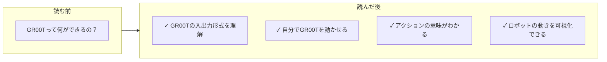
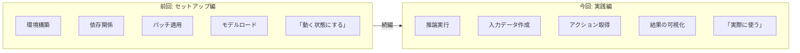
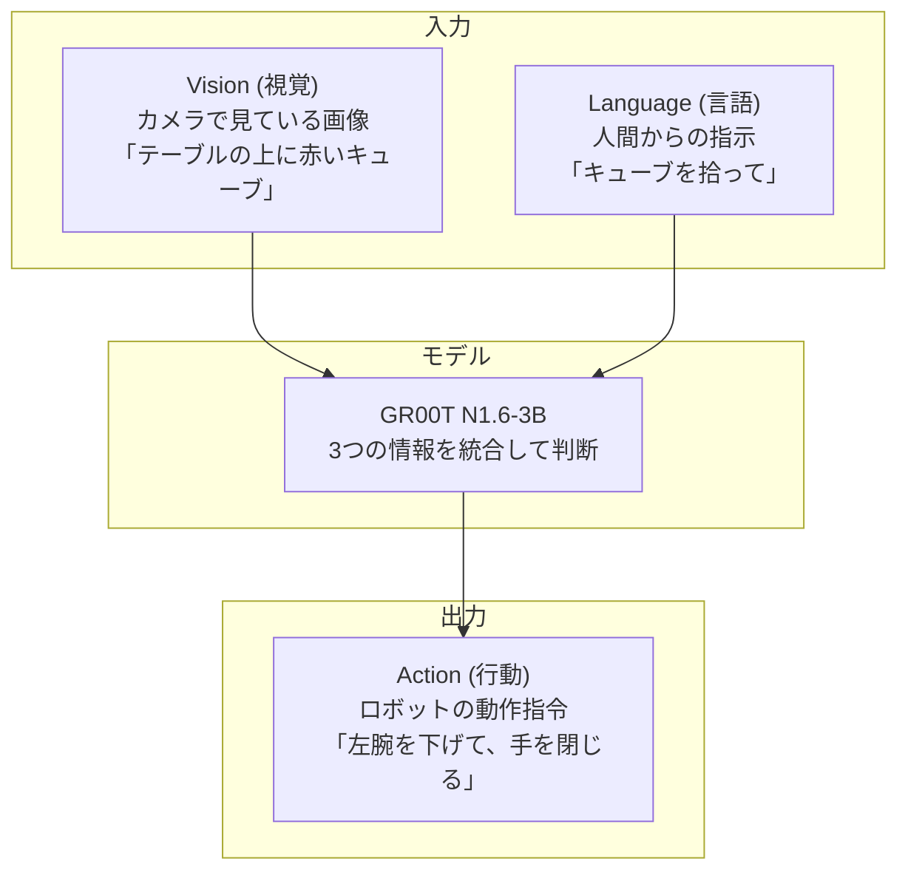
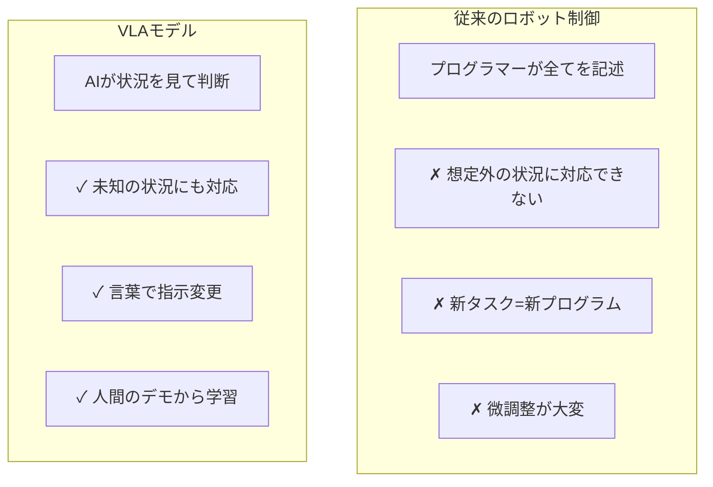
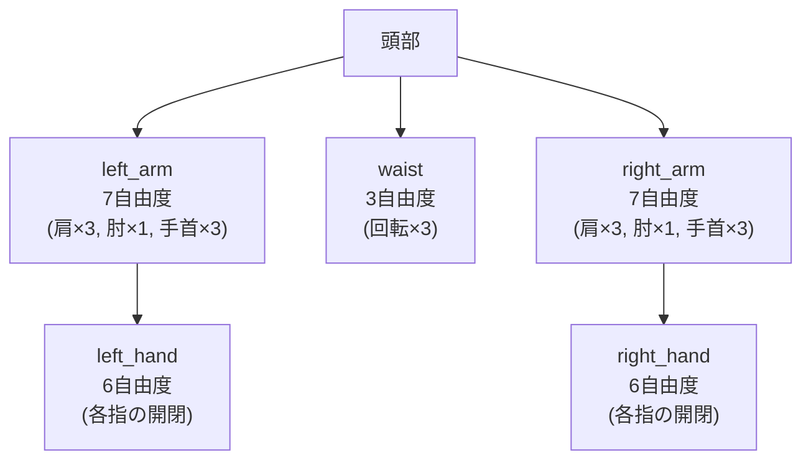
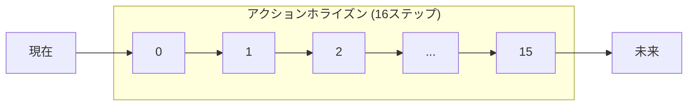
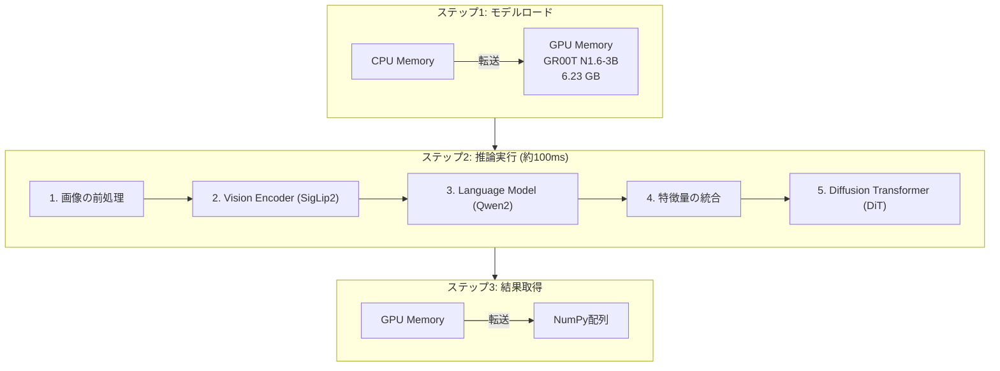
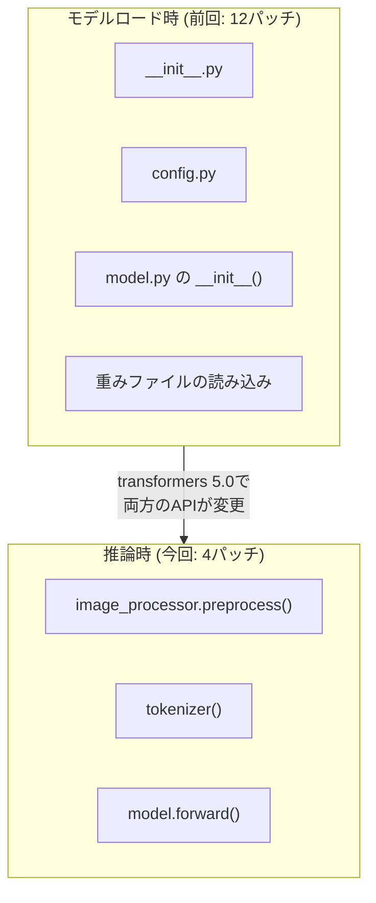

## 要約

- **GR00T N1.6-3B** をDGX Sparkで動かし、**ロボットアクションを生成・可視化**
- 推論実行時に **追加4個の互換性パッチ** を発見・解決（合計16個）
- **100ms / 10Hz** の推論速度、**6.23GB** のGPUメモリ使用
- アニメーションで**ロボットの動きを直感的に理解**できるデモを作成

```
=== 最終結果 ===
Model:      GR00T N1.6-3B (33億パラメータ)
Device:     DGX Spark (Blackwell GB10)
Inference:  100.2 ms (10.0 Hz)
GPU Memory: 6.23 GB
Status:     ✓ 推論・可視化 成功
```

---

## はじめに：この記事で学べること



### 前回の記事との違い



---

## GR00Tとは何か？（初心者向け解説）

### VLAモデルとは

GR00Tは**Vision-Language-Action (VLA)** モデルです。3つの入力から1つの出力を生成します。



### なぜVLAモデルが革新的なのか



**従来のコード例:**
```python
if (赤いキューブを検出):
    if (距離 < 30cm):
        手を開く()
        腕を下げる(10cm)
        手を閉じる()
```

**VLAのコード例:**
```python
action = groot.get_action(
    image=カメラ画像,
    instruction="キューブを拾って"
)
```

---

## GR00Tの入出力を詳しく理解する

### 入力1: カメラ画像 (Vision)

```python
'video': {
    'ego_view_bg_crop_pad_res256_freq20': np.array(
        shape=(1, 1, 256, 256, 3),
        dtype=np.uint8
    )
}
```

**なぜこの形式なのか？**

```
┌─────────────────────────────────────────────────────────────┐
│                  画像入力の次元解説                          │
├─────────────────────────────────────────────────────────────┤
│                                                             │
│  shape = (1, 1, 256, 256, 3)                               │
│           │  │   │    │   │                                │
│           │  │   │    │   └── 色: RGB 3チャンネル          │
│           │  │   │    │       なぜ？ カラー画像だから       │
│           │  │   │    │                                    │
│           │  │   │    └────── 幅: 256ピクセル              │
│           │  │   │            なぜ？ 計算効率と精度のバランス│
│           │  │   │                                         │
│           │  │   └─────────── 高さ: 256ピクセル            │
│           │  │                なぜ？ 正方形で処理しやすい   │
│           │  │                                             │
│           │  └─────────────── 時間: 1フレーム              │
│           │                   なぜ？ 現在の瞬間だけで判断   │
│           │                   （動画全体は不要）            │
│           │                                                │
│           └────────────────── バッチ: 1                    │
│                               なぜ？ 1台のロボットを制御    │
│                               （並列制御なら増やせる）      │
│                                                             │
└─────────────────────────────────────────────────────────────┘
```

**キー名の意味:**

```
'ego_view_bg_crop_pad_res256_freq20'
 └──┬──┘ └┬┘ └─┬─┘ └┬┘ └──┬──┘ └─┬─┘
    │     │    │    │     │      │
    │     │    │    │     │      └─ 20Hz: サンプリング周波数
    │     │    │    │     └──────── res256: 256x256解像度
    │     │    │    └────────────── pad: パディング処理済み
    │     │    └─────────────────── crop: 切り抜き処理済み
    │     └──────────────────────── bg: 背景処理済み
    └────────────────────────────── ego_view: 一人称視点
```

### 入力2: 関節状態 (State)

```python
'state': {
    'left_arm':   np.zeros((1, 1, 7), dtype=np.float32),
    'right_arm':  np.zeros((1, 1, 7), dtype=np.float32),
    'left_hand':  np.zeros((1, 1, 6), dtype=np.float32),
    'right_hand': np.zeros((1, 1, 6), dtype=np.float32),
    'waist':      np.zeros((1, 1, 3), dtype=np.float32),
}
```

**なぜボディパーツごとに分けるのか？**



**合計**: 7 + 7 + 6 + 6 + 3 = **29次元**

**なぜ分けるのか？**
- ✓ 部位ごとに独立して制御可能
- ✓ 一部のセンサーが故障しても他は動く
- ✓ 異なるロボットへの転移が容易

### 入力3: 言語指示 (Language)

```python
'language': {
    'task': [['pick up the cube']]
}
```

**なぜネストしたリストなのか？**

```
┌─────────────────────────────────────────────────────────────┐
│                  言語入力の形式                              │
├─────────────────────────────────────────────────────────────┤
│                                                             │
│  [['pick up the cube']]                                    │
│   │ └────────────────── 実際の指示テキスト                  │
│   └──────────────────── バッチ次元                          │
│                                                             │
│  なぜこの形式？                                             │
│                                                             │
│  1台のロボット:  [['pick up the cube']]                    │
│                                                             │
│  3台同時制御:    [['pick up the cube'],                    │
│                   ['place it down'],                        │
│                   ['move left']]                            │
│                                                             │
│  → バッチ処理で複数ロボットを効率的に制御できる             │
│                                                             │
└─────────────────────────────────────────────────────────────┘
```

### 出力: アクション (Action)

```python
action = {
    'left_arm':   shape=(1, 16, 7),   # 16ステップ × 7関節
    'right_arm':  shape=(1, 16, 7),
    'left_hand':  shape=(1, 16, 6),
    'right_hand': shape=(1, 16, 6),
    'waist':      shape=(1, 16, 3),
}
```

**16ステップとは？（アクションホライズン）**



**なぜ複数ステップを予測するのか？**
- ✓ 滑らかな動作: 急な動きを避けられる
- ✓ 効率的: 毎フレーム推論しなくてもOK
- ✓ 賢い判断: 先を見据えた動作計画が可能

**実際の使い方:**
```python
for t in range(16):
    robot.move(action[t])  # 1ステップずつ実行
    time.sleep(0.05)       # 50ms待機 (20Hz)

# 16ステップ終わったら再度推論
action = groot.get_action(new_observation)
```

---

## GPU使用について

### GR00TはGPUをどう使うのか？



### 実際のGPUメモリ使用量

```
=== GPU Usage Summary ===
Device: NVIDIA GB10 (Blackwell)
Memory after model load: 6.23 GB  ← モデル重み
Memory after inference:  6.23 GB  ← 推論中も同じ（効率的）
Inference time: 100.2 ms          ← GPU上で計算

Total GPU Memory: 128 GB (UMA)
Used: 6.23 GB (約5%)              ← まだ余裕がある
```

---

## 推論実行時に発生した問題と解決

前回の記事で12個のパッチを適用しましたが、**実際に推論を実行すると追加で4個の問題**が発生しました。

### なぜモデルロードと推論で別の問題が起きるのか？



### 問題13: メソッド名の変更

**エラー:**
```
AttributeError: '_prepare_input_images' not found
```

**原因と解決:**
```
┌─────────────────────────────────────────────────────────────┐
│                                                             │
│  transformers 4.x                transformers 5.0          │
│  ─────────────────                ─────────────────         │
│  _prepare_input_images()    →    _prepare_image_like_inputs()
│                                                             │
│  【なぜ変更されたのか？】                                   │
│  画像だけでなくビデオも同じメソッドで処理するため          │
│  "input_images" → "image_like_inputs" (画像っぽいもの全般)  │
│                                                             │
│  【解決策】                                                 │
│  # 両方のバージョンに対応                                   │
│  prepare_fn = getattr(self, '_prepare_image_like_inputs',  │
│                       getattr(self, '_prepare_input_images'))│
│                                                             │
└─────────────────────────────────────────────────────────────┘
```

### 問題14: メソッド引数の追加

**エラー:**
```
TypeError: unexpected keyword argument 'expected_ndims'
```

**原因と解決:**
```
┌─────────────────────────────────────────────────────────────┐
│                                                             │
│  transformers 4.x:                                         │
│  def _prepare_images_structure(self, images):              │
│      ...                                                   │
│                                                             │
│  transformers 5.0:                                         │
│  def _prepare_images_structure(self, images, expected_ndims=3):
│                                              ↑ 新しい引数   │
│                                                             │
│  【なぜ追加されたのか？】                                   │
│  画像の次元数を柔軟に指定できるように                       │
│  (2D画像=3次元, 動画=4次元, など)                           │
│                                                             │
│  【解決策】                                                 │
│  # Eagleクラスでも新しい引数を受け取るように修正            │
│  def _prepare_images_structure(self, images, expected_ndims=3):
│      return make_flat_list_of_images(images)  # 中身は同じ  │
│                                                             │
└─────────────────────────────────────────────────────────────┘
```

### 問題15: 辞書キーの消失

**エラー:**
```
KeyError: 'resample'
```

**原因と解決:**
```
┌─────────────────────────────────────────────────────────────┐
│                                                             │
│  【元のコード】                                             │
│  resample = kwargs.pop("resample")  # 必ず存在すると仮定    │
│                                                             │
│  【問題】                                                   │
│  transformers 5.0 の _validate_preprocess_kwargs() が      │
│  一部のキーを削除するようになった                           │
│                                                             │
│  kwargs の変化:                                             │
│  {'resample': BICUBIC, 'size': 256, ...}                   │
│           ↓ _validate_preprocess_kwargs()                  │
│  {'size': 256, ...}  ← resample が消えた！                 │
│                                                             │
│  【解決策】                                                 │
│  # デフォルト値を指定してエラーを防ぐ                       │
│  resample = kwargs.pop("resample", self.resample)          │
│                                     ↑ なければクラスの値    │
│                                                             │
└─────────────────────────────────────────────────────────────┘
```

### 問題16: 必須引数の追加

**エラー:**
```
TypeError: missing required argument 'disable_grouping'
```

**原因と解決:**
```
┌─────────────────────────────────────────────────────────────┐
│                                                             │
│  transformers 4.x:                                         │
│  group_images_by_shape(images)                             │
│                                                             │
│  transformers 5.0:                                         │
│  group_images_by_shape(images, *, disable_grouping)        │
│                                   ↑ 必須キーワード引数      │
│                                                             │
│  【なぜ追加されたのか？】                                   │
│  大量の画像を処理する際、グループ化をスキップして          │
│  メモリを節約するオプションが必要になった                   │
│                                                             │
│  【解決策】                                                 │
│  grouped = group_images_by_shape(                          │
│      images,                                                │
│      disable_grouping=False  # グループ化を有効にする      │
│  )                                                          │
│                                                             │
└─────────────────────────────────────────────────────────────┘
```

---

## 実際に動かしてみよう

### 準備: パッチ適用済み環境

前回の記事の手順でセットアップが完了していることを前提とします。

### デモ1: 基本的な推論

```bash
cd /home/amn_ndspk/isaac/Isaac-GR00T
source .venv/bin/activate
python run_groot_demo.py
```

**出力例:**
```
[GPU情報]
  CUDA利用可能: True
  GPU名: NVIDIA GB10
  GPUメモリ: 6.23 GB

[推論結果]
  Inference time: 100.2 ms (10.0 Hz)

  left_arm:   shape=(1, 16, 7), range=[-0.23, 0.08]
  right_arm:  shape=(1, 16, 7), range=[-0.15, 0.26]
  left_hand:  shape=(1, 16, 6), range=[-1.09, 0.29]
  right_hand: shape=(1, 16, 6), range=[-0.82, 1.47]
  waist:      shape=(1, 16, 3), range=[-0.00, 0.15]
```

### デモ2: 実画像での推論

```bash
python run_groot_real_demo.py
```

**実際のデモデータ**（GR1ヒューマノイドのPick&Place動画）を使って推論します。

### デモ3: アニメーション表示

```bash
python run_groot_simple_animation.py
```

**出力されるアニメーション:**

```
┌─────────────────────────────────────────────────────────────┐
│                 アニメーションの構成                         │
├─────────────────────────────────────────────────────────────┤
│                                                             │
│  ┌────────────┐  ┌──────────────────┐  ┌────────────┐      │
│  │            │  │                  │  │            │      │
│  │ Input      │  │    Robot         │  │  Step      │      │
│  │ Image      │  │    Animation     │  │  5 / 16    │      │
│  │            │  │                  │  │            │      │
│  │ [実画像]   │  │    ○  ← 頭      │  │ ████████░░ │      │
│  │            │  │   /█\            │  │            │      │
│  │            │  │  ╱ █ ╲  ← 腕    │  │            │      │
│  │            │  │ ●  █  ●          │  │            │      │
│  │            │  │   ╱╲            │  │            │      │
│  │            │  │  ╱  ╲ ← 脚      │  │            │      │
│  │            │  │                  │  │            │      │
│  └────────────┘  └──────────────────┘  └────────────┘      │
│                                                             │
│  ┌──────────────────────┐  ┌──────────────────────┐        │
│  │ Left Arm Gauge       │  │ Right Arm Gauge      │        │
│  │ ████████░░░░░░░░░░   │  │ ░░░░░░░░░░████████   │        │
│  │ 0.123 rad            │  │ -0.089 rad           │        │
│  └──────────────────────┘  └──────────────────────┘        │
│                                                             │
│  ┌──────────────────────┐  ┌──────────────────────┐        │
│  │ Left Hand            │  │ Right Hand           │        │
│  │     ▄ ▄              │  │       ▄              │        │
│  │   ▄ █ █ ▄            │  │     ▄ █ ▄ ▄         │        │
│  │   █ █ █ █ ▄          │  │   ▄ █ █ █ █ ▄       │        │
│  │  ─────────────       │  │  ─────────────       │        │
│  │  CLOSE               │  │  OPEN                │        │
│  └──────────────────────┘  └──────────────────────┘        │
│                                                             │
└─────────────────────────────────────────────────────────────┘
```

### アニメーションの見方

```
┌─────────────────────────────────────────────────────────────┐
│                  アニメーション凡例                          │
├─────────────────────────────────────────────────────────────┤
│                                                             │
│  【色の意味】                                               │
│  ┌─────────────────────────────────────────────────────┐   │
│  │  青 (Blue)   = 左腕・左手                           │   │
│  │  赤 (Red)    = 右腕・右手                           │   │
│  │  緑 (Green)  = 進行状況バー                         │   │
│  │  灰色 (Gray) = 脚・背景                             │   │
│  └─────────────────────────────────────────────────────┘   │
│                                                             │
│  【手の状態表示】                                           │
│  ┌─────────────────────────────────────────────────────┐   │
│  │  OPEN  (緑文字) = 手を開く動作 (正の値)             │   │
│  │  CLOSE (赤文字) = 手を閉じる動作 (負の値)           │   │
│  │  HOLD  (灰文字) = 現状維持 (ほぼ0)                  │   │
│  └─────────────────────────────────────────────────────┘   │
│                                                             │
│  【ゲージの意味】                                           │
│  ┌─────────────────────────────────────────────────────┐   │
│  │  ████████░░░░░░░░░░  →  正の方向に動いている        │   │
│  │  ░░░░░░░░░░████████  →  負の方向に動いている        │   │
│  │  ░░░░░░████░░░░░░    →  中央付近（あまり動かない）  │   │
│  └─────────────────────────────────────────────────────┘   │
│                                                             │
└─────────────────────────────────────────────────────────────┘
```

---

## ベンチマーク結果

### DGX Spark での性能

```
┌─────────────────────────────────────────────────────────────┐
│                    推論速度ベンチマーク                      │
├─────────────────────────────────────────────────────────────┤
│                                                             │
│  環境: DGX Spark (Blackwell GB10, 128GB UMA)               │
│  モデル: GR00T N1.6-3B                                     │
│                                                             │
│  ┌─────────────────────────────────────────────────────┐   │
│  │ Warmup (初回):     687.1 ms                         │   │
│  │   └── JITコンパイル、CUDAカーネル初期化を含む       │   │
│  │                                                     │   │
│  │ Run 1:             99.7 ms                          │   │
│  │ Run 2:             99.2 ms                          │   │
│  │ Run 3:            101.1 ms                          │   │
│  │ Run 4:             98.8 ms                          │   │
│  │ Run 5:            102.3 ms                          │   │
│  │                                                     │   │
│  │ ━━━━━━━━━━━━━━━━━━━━━━━━━━━━━━━━━━━━━━━━━━━━━━━━━━ │   │
│  │ Average:          100.2 ms (10.0 Hz)                │   │
│  │ GPU Memory:         6.23 GB                         │   │
│  └─────────────────────────────────────────────────────┘   │
│                                                             │
│  【10Hzで何ができるか？】                                   │
│  ✓ 0.1秒ごとにロボットに新しい指令を送れる                 │
│  ✓ 人間の反応速度（0.2秒）より速い                         │
│  ✓ 一般的なロボット制御（10-100Hz）の範囲内                │
│                                                             │
└─────────────────────────────────────────────────────────────┘
```

---

## まとめ: 全パッチ一覧

### モデルロード時（前回: 12個）

| # | 問題 | 解決策 |
|---|------|--------|
| 1 | VideoInput import | video_utilsからインポート |
| 2 | DOCSTRING定数 | 空文字列で代替 |
| 3 | DefaultFastImageProcessorKwargs | ImagesKwargsにフォールバック |
| 4 | validate_init_kwargs戻り値 | tuple対応 |
| 5 | Beta分布meta tensor | validate_args=False |
| 6 | all_tied_weights_keys | プロパティ追加 |
| 7-12 | その他初期化 | 詳細は前回記事 |

### 推論実行時（今回: 4個）

| # | 問題 | 解決策 |
|---|------|--------|
| 13 | _prepare_input_images | メソッド名変更に対応 |
| 14 | expected_ndims | 引数追加 |
| 15 | resample KeyError | デフォルト値追加 |
| 16 | disable_grouping | 必須引数追加 |

---

## 参考リンク

- [前回の記事: DGX SparkでGR00T N1セットアップ](https://zenn.dev/atsurobo/articles/dgx-spark-groot-n1-setup-guide)
- [NVIDIA Isaac GR00T](https://developer.nvidia.com/isaac/gr00t)
- [GitHub - Isaac-GR00T](https://github.com/NVIDIA/Isaac-GR00T)
- [GR00T N1 論文 (arXiv)](https://arxiv.org/abs/2503.14734)

---

*本記事は2026年2月5日時点の情報に基づいています。*
*DGX Spark + transformers 5.0環境でのGR00T N1推論・可視化の詳細ガイドです。*
