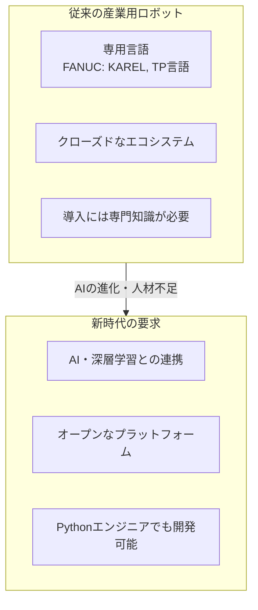
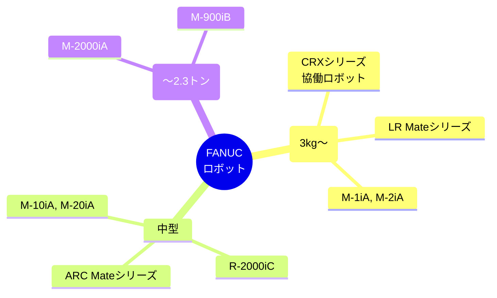
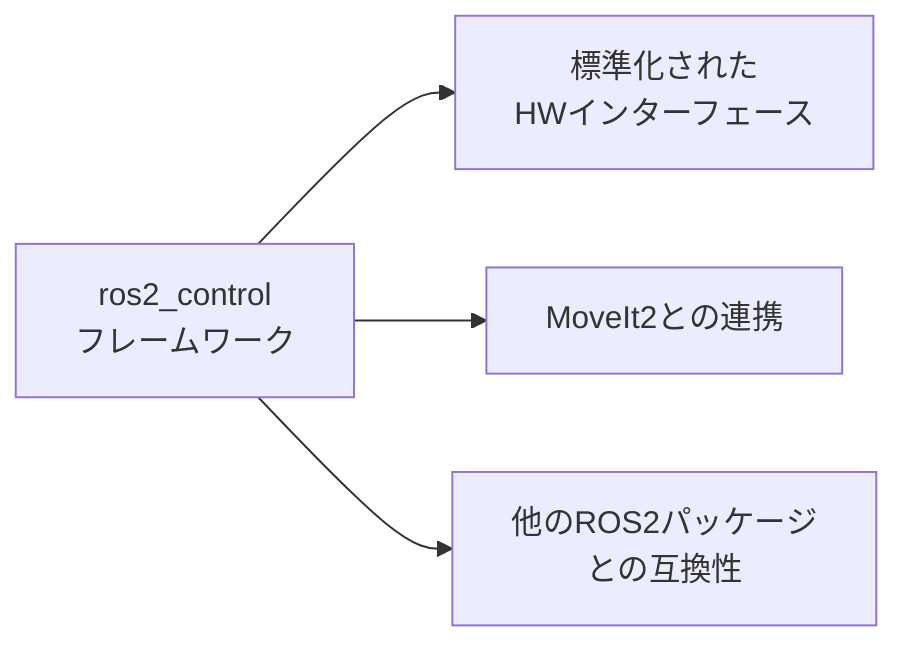
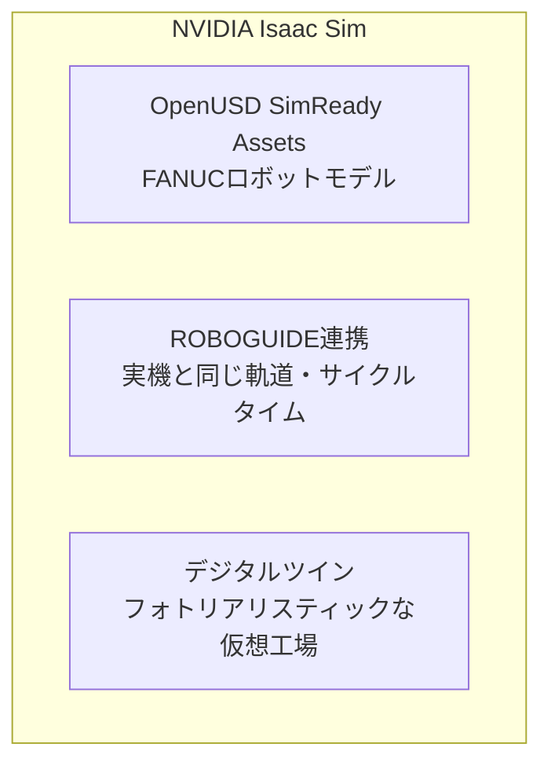
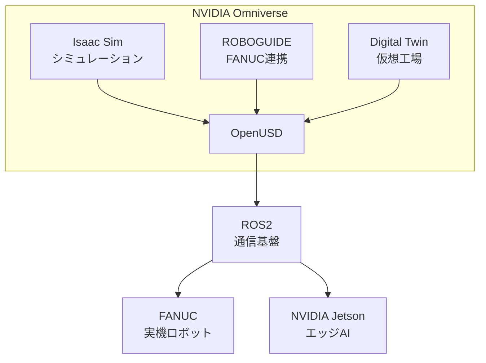
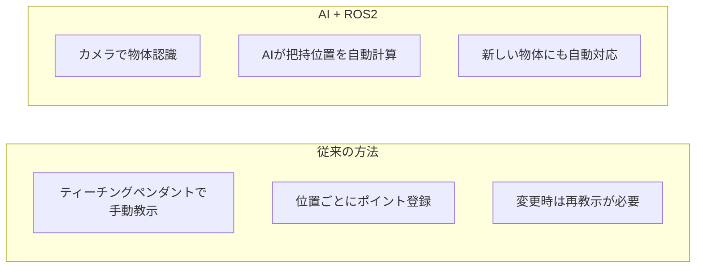
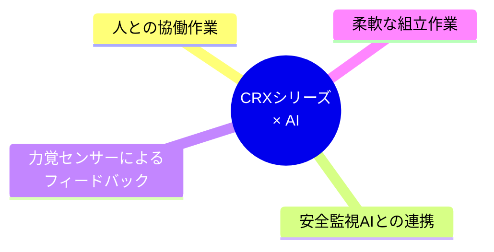
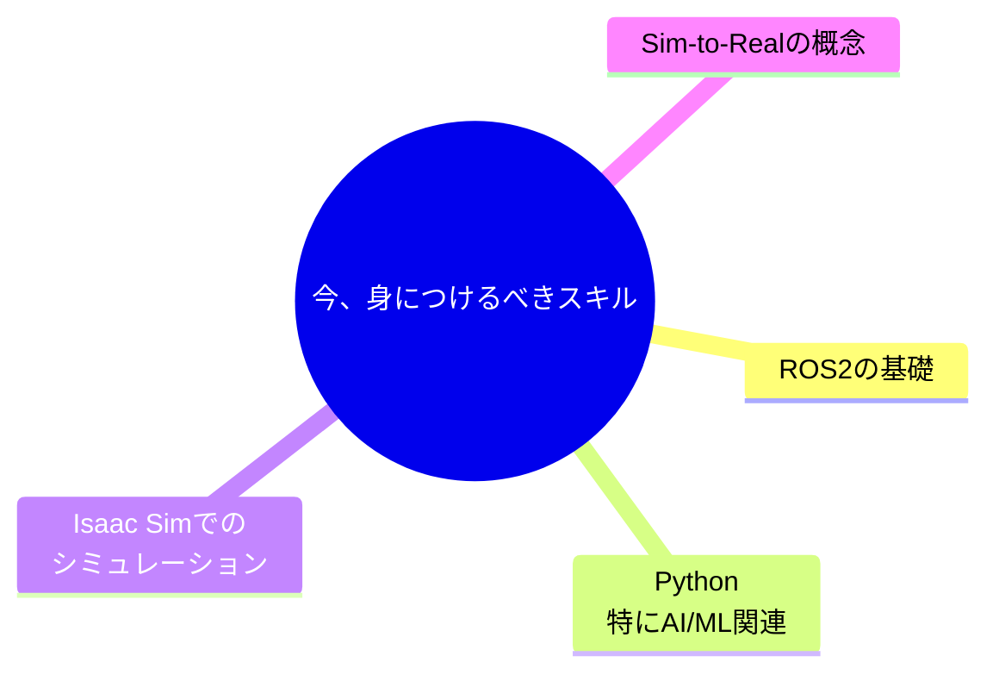

FANUCが公式ROS2ドライバをリリースし、NVIDIAとのコラボレーションでIsaac Simとの連携が可能に。日本の製造業におけるフィジカルAI導入の新時代が始まった。

---

## エグゼクティブサマリー

| トピック | 内容 |
|----------|------|
| **発表** | FANUCが公式ROS2ドライバをオープンソースで公開 |
| **連携** | NVIDIA Isaac SimとFANUC ROBOGUIDEの統合 |
| **対象** | 3kg〜2.3トンの全FANUCロボット |
| **特徴** | 1msの超高速制御、Python対応、デジタルツイン |

---

## 目次

1. [背景：なぜ今FANUCがROS2対応したのか](#1-背景なぜ今fanucがros2対応したのか)
2. [FANUC ROS2ドライバの概要](#2-fanuc-ros2ドライバの概要)
3. [NVIDIA Isaac Simとの連携](#3-nvidia-isaac-simとの連携)
4. [実践：環境構築手順](#4-実践環境構築手順)
5. [ユースケース](#5-ユースケース)

---

## 1. 背景：なぜ今FANUCがROS2対応したのか

### 製造業を取り巻く変化



### FANUCの決断

FANUCは2025年末、以下を発表：

1. **ROS2公式ドライバのオープンソース公開**
2. **NVIDIAとの戦略的パートナーシップ**
3. **Pythonのネイティブサポート**

> "FANUCは、AIの進歩をロボットに適用して自動化を加速するため、オープンプラットフォームを強力にサポートしています"
> — FANUC公式発表より

---

## 2. FANUC ROS2ドライバの概要

### 基本情報

| 項目 | 内容 |
|------|------|
| **リポジトリ** | [FANUC-CORPORATION/fanuc_driver](https://github.com/FANUC-CORPORATION/fanuc_driver) |
| **ドキュメント** | [FANUC ROS 2 Driver Documentation](https://fanuc-corporation.github.io/fanuc_driver_doc/main/index.html) |
| **ライセンス** | オープンソース |
| **対応ROS2** | Humble / Iron / Jazzy |

### 対応ロボット



### 主な特徴

#### 1. ros2_control対応



#### 2. 超高速制御

| 項目 | 値 |
|------|-----|
| 制御周期 | **1ms**（業界最高水準） |
| 通信方式 | Ethernet/IP |
| リアルタイム性 | 高精度モーション制御対応 |

#### 3. Python対応

```python
# FANUCロボットをPythonで制御（イメージ）
import rclpy
from fanuc_driver.robot import FanucRobot

robot = FanucRobot()
robot.move_to_pose(x=0.5, y=0.0, z=0.3)
robot.gripper.close()
```

---

## 3. NVIDIA Isaac Simとの連携

### FANUCとNVIDIAのコラボレーション



### 何ができるようになるか

| 機能 | 説明 |
|------|------|
| **AIデータ生成** | 仮想工場で学習データを大量生成 |
| **シミュレーション** | 実機導入前に検証 |
| **Sim-to-Real** | シミュレーションで学習 → 実機に転移 |
| **生産テスト** | 実際の生産オペレーションを仮想で検証 |

### 統合アーキテクチャ



---

## 4. 実践：環境構築手順

### 前提条件

| 項目 | 要件 |
|------|------|
| OS | Ubuntu 22.04 / 24.04 |
| ROS2 | Humble / Iron / Jazzy |
| Python | 3.10以上 |
| GPU | NVIDIA（Isaac Sim用） |

### Step 1: ROS2環境構築

```bash
# ROS2 Jazzyのインストール（Ubuntu 24.04）
sudo apt update
sudo apt install -y software-properties-common
sudo add-apt-repository universe
sudo apt update && sudo apt install -y curl

# ROS2リポジトリ追加
sudo curl -sSL https://raw.githubusercontent.com/ros/rosdistro/master/ros.key -o /usr/share/keyrings/ros-archive-keyring.gpg
echo "deb [arch=$(dpkg --print-architecture) signed-by=/usr/share/keyrings/ros-archive-keyring.gpg] http://packages.ros.org/ros2/ubuntu $(. /etc/os-release && echo $UBUNTU_CODENAME) main" | sudo tee /etc/apt/sources.list.d/ros2.list > /dev/null

# インストール
sudo apt update
sudo apt install -y ros-jazzy-desktop

# 環境設定
echo "source /opt/ros/jazzy/setup.bash" >> ~/.bashrc
source ~/.bashrc
```

### Step 2: FANUC ROS2ドライバのインストール

```bash
# ワークスペース作成
mkdir -p ~/fanuc_ws/src
cd ~/fanuc_ws/src

# FANUCドライバをクローン
git clone https://github.com/FANUC-CORPORATION/fanuc_driver.git

# 依存関係のインストール
cd ~/fanuc_ws
rosdep install --from-paths src --ignore-src -r -y

# ビルド
colcon build --symlink-install

# 環境設定
echo "source ~/fanuc_ws/install/setup.bash" >> ~/.bashrc
source ~/.bashrc
```

### Step 3: Isaac Simとの連携（オプション）

```bash
# Isaac SimでFANUCロボットを使用する場合
# 1. Isaac Simをインストール（NVIDIA公式手順に従う）
# 2. OpenUSD SimReady AssetsからFANUCモデルを取得
# 3. ROS2ブリッジを有効化
```

### 接続テスト

```bash
# FANUCロボットへの接続（シミュレーション）
ros2 launch fanuc_driver fanuc_sim.launch.py

# 実機接続（IPアドレスを指定）
ros2 launch fanuc_driver fanuc_robot.launch.py robot_ip:=192.168.1.100
```

---

## 5. ユースケース

### 5-1. ピック＆プレース自動化



### 5-2. デジタルツインによる事前検証


### 5-3. 協働ロボット（CRX）+ AI



---

## まとめ

### FANUCがROS2対応した意義

| 変化 | インパクト |
|------|-----------|
| オープン化 | AI研究者・スタートアップが参入しやすく |
| Python対応 | 機械学習エンジニアが即戦力に |
| NVIDIA連携 | Sim-to-Realが製造業で現実的に |

### 製造業エンジニアへのメッセージ



FANUCの公式対応により、これらのスキルが製造業で直接活かせる時代が来た。

---

## 参考リンク

### 公式リソース

- [FANUC ROS 2 Driver GitHub](https://github.com/FANUC-CORPORATION/fanuc_driver)
- [FANUC ROS 2 Driver Documentation](https://fanuc-corporation.github.io/fanuc_driver_doc/main/index.html)
- [FANUC公式発表: Open Platforms & Physical AI](https://www.fanuc.co.jp/en/product/new_product/2025/202512_robot_physicalai.html)

### NVIDIAリソース

- [NVIDIA Isaac Sim](https://developer.nvidia.com/isaac/sim)
- [NVIDIA Isaac ROS](https://nvidia-isaac-ros.github.io/)

### 関連記事

- [FANUC and NVIDIA forge new era of physical AI](https://www.themanufacturer.com/articles/fanuc-and-nvidia-forge-new-era-of-physical-ai-for-industrial-robotics/)
- [ros2_fanuc_interface: Design and Evaluation (arXiv)](https://arxiv.org/html/2506.14487v1)
